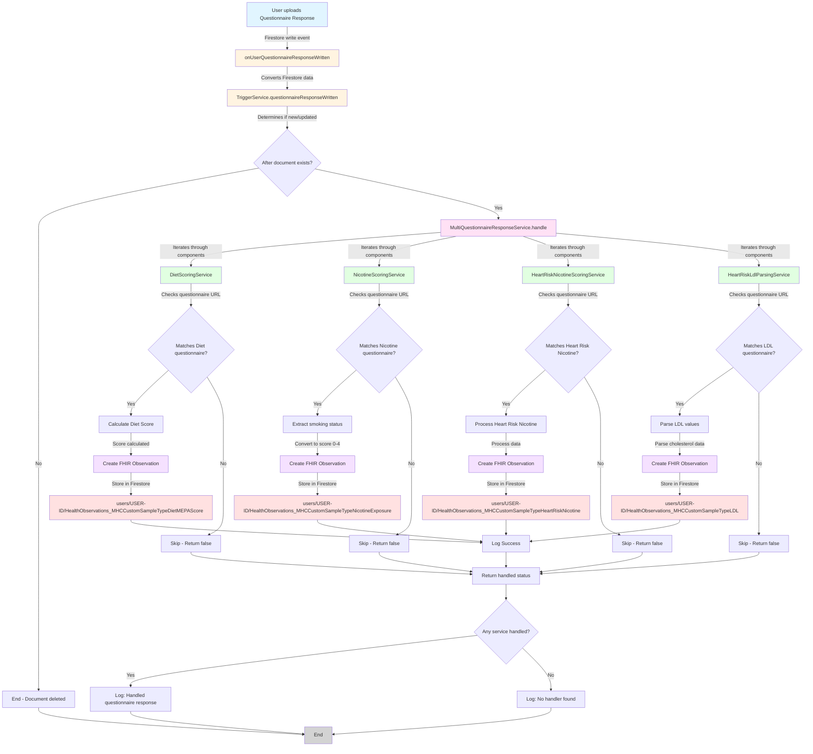
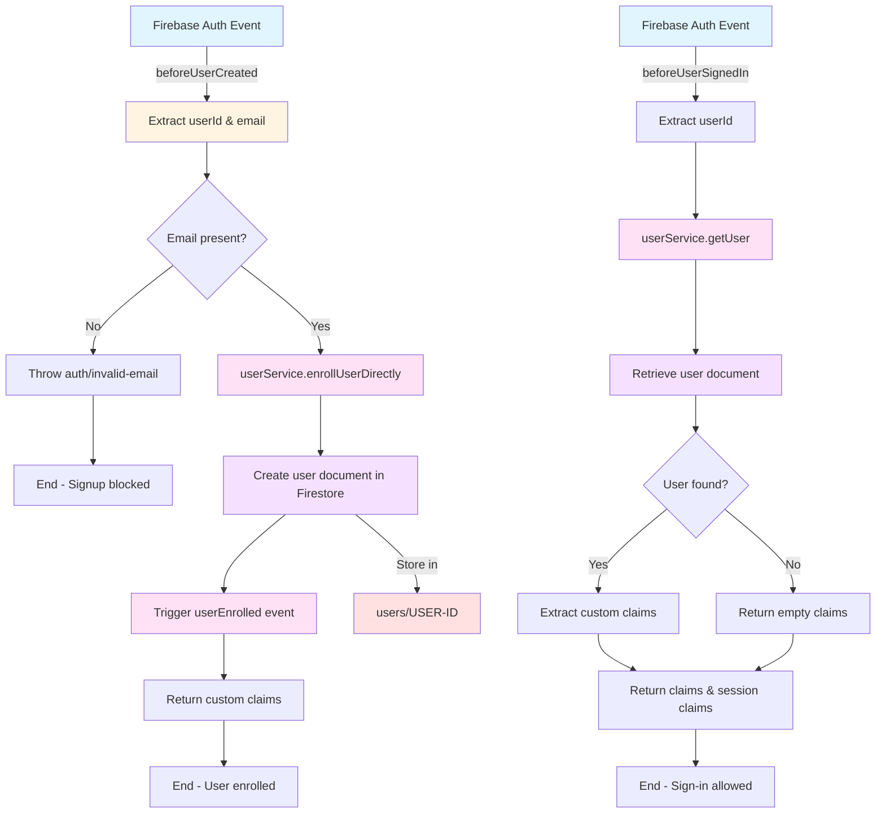
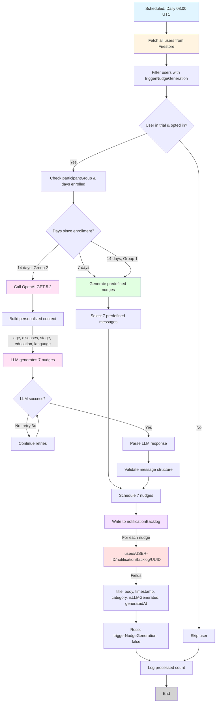
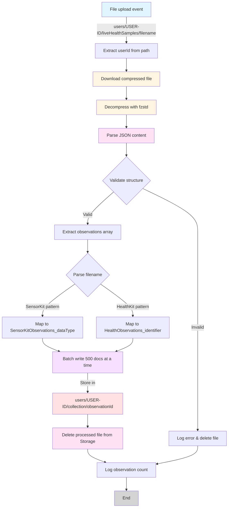
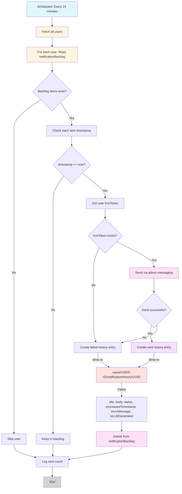
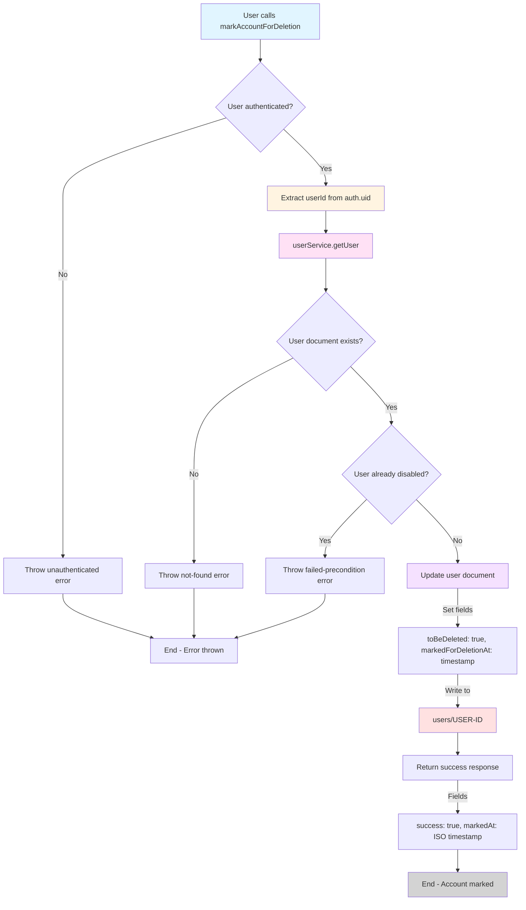
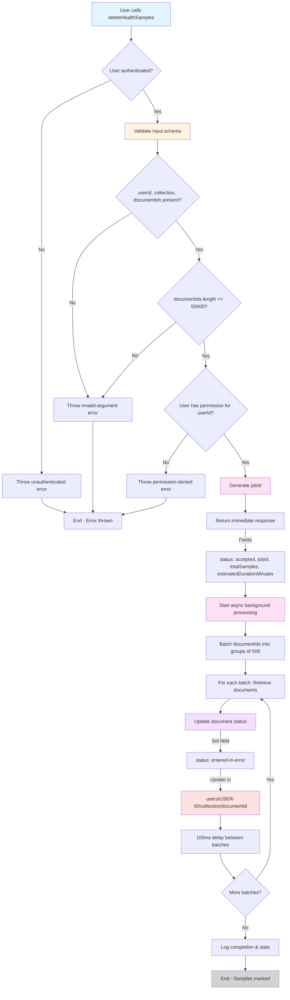

<!-- 
This source file is part of the Stanford Biodesign Digital Health MyHeart Counts open-source project
SPDX-FileCopyrightText: 2025 Stanford University and the project authors (see CONTRIBUTORS.md)
SPDX-License-Identifier: MIT
-->
[](https://github.com/StanfordBDHG/MyHeartCounts-Firebase/actions/workflows/build-and-test.yml)
[](https://github.com/StanfordBDHG/MyHeartCounts-Firebase/actions/workflows/codeql.yml)
[](https://github.com/StanfordBDHG/MyHeartCounts-Firebase/actions/workflows/deployment.yml)

# My Heart Counts

Firebase cloud hosting infrastructure for the Stanford MyHeart Counts project.

The iOS Application can be found in the [StanfordBDHG/MyHeartCounts-iOS](https://github.com/StanfordBDHG/MyHeartCounts-iOS) repository, the repository for the data analysis side of this study can be found over at [StanfordBDHG/MyHeartCounts-DataAnalysis](https://github.com/StanfordBDHG/MyHeartCounts-DataAnalysis).

The study itself with its contents is defined in [StanfordBDHG/MyHeartCounts-StudyDefinitions](https://github.com/StanfordBDHG/MyHeartCounts-StudyDefinitions).

Key features of the backend infrastructure include:
- User account setup using blocking functions
- Decoding of archived sensor- and healthdata
- Questinaire parsing
- User State Handeling
- Physical Activity Trial with personalized coaching messages using a Large Language Model (LLM) to generate personalized physical activity nudges in a blind study approach to compare predefined nudges and LLM nudges

Addtionally, a collection of various [scripts](assets/scripts) support the active development and ongoing support of the My Heart Counts study.

> [!NOTE]
> Do you want to learn more about the Stanford Spezi Template Application and how to use, extend, and modify this application? Check out the [Stanford Spezi Template Application documentation](https://stanfordspezi.github.io/SpeziTemplateApplication).


## Data Structure

My Heart Counts Firebase makes extensive usage of both the Firestore Database (NoSQL cloud database) and Firebase Cloud Storage (object storage service). 

### Variables in the Data Structure

|Variable|Origin|Example|
|-|-|-|
|`{USER-ID}`|The Firebase-Generated Account User-ID|`vqzvMTfki9hD0yqTcVVW8XsKf6g2`|
|`{UUID}`|Randomly generated Sample ID|`BCD7D622-0CDC-4194-A008-3452C9C95546`|
|`{HEALTHKIT.IDENTIFIER}`|HealthKit Identifier / [HKQuantityTypeIdentifier](https://developer.apple.com/documentation/healthkit/hkquantitytypeidentifier)|`HKClinicalTypeIdentifierAllergyRecord`|
|`{SENSORKIT.IDENTIFIER}`|[Sensor identifier name](https://developer.apple.com/documentation/sensorkit/) from the SensorKit Framework|`com.apple.SensorKit.ambientPressure`|
|`{MHCCUSTOM.IDENTIFIER}`|Custom Sample Type defined for the My Heart Counts Study|`MHCHealthObservationTimedWalkingTestResultIdentifier`|
|`{TIMESTAMP}`|ISO 8601 Timestamp, delimited by an underscore (_) for time ranges|`2025-11-17T22:44:09Z_2025-11-17T23:44:09Z`|

### Firestore Database

|Path|Purpose|Fields|
|-|-|-|
|`/feedback/{UUID}`|Collection for Participant-Submitted Feedback|`accountId`, `appBuildNumber`, `appVersion`, `date`, `deviceInfo` (`model`, `osVersion`, `systemName`), `message`, `timeZone` (`identifier`)|
|`/users/{USER-ID}`|User Document|`biologicalSexAtBirth`, `bloodType`, `comorbidities` (Disease : year), `dateOfBirth`, `dateOfEnrollment`, `didOptInToTrial`, `disabled`, `fcmToken`, `futureStudies`, `heightInCM`, `householdIncomeUS`, `language`, `lastActiveDate`, `lastSignedConsentDate`, `lastSignedConsentVersion`, `latinoStatus`, `mhcGenderIdentity`, `mostRecentOnboardingStep`, `participantGroup`, `preferredNotificationTime`, `preferredWorkoutTypes`, `raceEthnicity`, `timeZone`, `usRegion`, `weightInKG`|
|`/users/{USER-ID}/questionnaireResponses/{UUID}`|FHIR questionnaire responses|See [FHIR questionnaireresponse documentation](https://build.fhir.org/questionnaireresponse.html)|
|`/users/{USER-ID}/notificationBacklog/{UUID}`|Backlog of Notifications to send|`body`, `category`, `generatedAt`, `id`, `isLLMGenerated`, `timestamp`, `title`|
|`/users/{USER-ID}/notificationHistory/{UUID}`|History of send notifications|`body`, `errorMessage`, `generatedAt`, `isLLMGenerated`, `originalTimestamp`, `processedTimestamp`, `status`, `title`|
|`/users/{USER-ID}/notificationTracking/{UUID}`|Tracks the Notification Status|`event`, `notificationId`, `timeZone`, `timestamp`|
|`/users/{USER-ID}/SensorKitObservations_deviceUsageReport/{UUID}`|Debug Info about Sensor Kit Hardware Environment|FHIR Observation for custom MHC sample|See [FHIR observation documentation](https://hl7.org/fhir/R4/observation.html)|
|`/users/{USER-ID}/HealthObservations_{HEALTHKIT.IDENTIFIER}/{UUID}`|FHIR Observation for given health kit type|See [FHIR observation documentation](https://hl7.org/fhir/R4/observation.html)|
|`/users/{USER-ID}/HealthObservations_{SENSORKIT.IDENTIFIER}/{Timestamp}`|FHIR Observation for given sensor kit type|See [FHIR observation documentation](https://hl7.org/fhir/R4/observation.html)|

### Firebase Cloud Storage

|Path|Purpose|
|-|-|
|`/public/mhcStudyBundle.spezistudybundle.aar`|This it the Study definition bundle auto-build by the workflow in [MyHeartCounts-StudyDefinitions](https://github.com/StanfordBDHG/MyHeartCounts-StudyDefinitions/blob/main/.github/workflows/publish-study-definition.yml)|
|`/user/{USER-ID}/consent`|PDF Files of every consent the user gave (this could be multiple in the case of consent revisions or re-signup by the user.)|
|`/user/{USER-ID}/historicalHealthSamples/{HEALTHKIT.IDENTIFIER}{UUID}.json.zstd`|We collect health samples that were recorded before the user enrolled into the app, compress them via zstd and store them as-is in the folder historicalHealthSamples for future analytics|
|`/user/{USER-ID}/liveHealthSamples/{UUID}.json.zstd`|Most recorded ongoing (new) health samples get directly uploaded into the Firestore NoSQL Database - however, if a large amount of data has accumulated, we archive these samples for server-side decoding and upload them into liveHealthSamples. **This folder will be empty most of the time!** On Upload, the function [onArchivedLiveHealthSampleUploaded.ts](functions/src/functions/onArchivedLiveHealthSampleUploaded.ts) gets triggered which upon successful unpacking and storing into the Firestore Database deletes the live health sample archive.|
|`/user/{USER-ID}/SensorKit/{SENSORKIT.IDENTIFIER}/{UUID}.csv.zstd`|Samples from Apple's SensorKit Framework, sorted in sub-folders.|

## Development

This section contains developer information to kickstart local- and cloud development using the ressources from this repository.

### Infrastructure Overview

To use Firebase functions for your own project or to emulate them for client applications, this section will help to give an overview of the different packages in use and how to install, build, test and launch them.

This repository contains two separate packages.

- The package located in [functions/models](functions/models) contains model types including decoding/encoding functions and useful extensions that are shared between the Firebase functions.
- The package located in [functions](functions) contains the Firebase functions and services that are called from these functions. This package has a local dependency on the package in [functions/models](functions/models). Therefore, the functions package does not work (e. g. for linting, building, etc) without building the models package first.

### Project Scripts

To make this structure simpler to use, we provide different scripts as part of the [package.json](package.json) file in the root directory of this repository. The file ensures execution order between the two packages. We only document the scripts located in this file, since they cover the most common use cases, feel free to have a look at the individual package.json files of the respective packages to get a deeper understanding and more package-focused operations.

|Command|Purpose|
|-|-|
|`npm run install`|Installs dependencies (incl. dev dependencies) for both packages.|
|`npm run clean`|Cleans existing build artifacts for both packages.|
|`npm run build`|Builds both packages. If you have added or removed files in one of the packages, make sure to clean before using this command.|
|`npm run lint`|Lints both packages. Make sure to build before using this command. You may want to append `:fix` to fix existing issues automatically or `:strict` to make sure the command does not succeed with existing warnings or errors.|
|`npm run prepare`|Combines cleaning, installing and building both packages.|
|`npm run test:ci`|Tests the Firebase functions with emulators running and with test coverage collection active.|
|`npm run serve:seeded`|Starts up the relevant emulators for MyHeart Counts and seeds them. Make sure to build the project first before executing this command.|

For using the emulators for client applications, it is probably easiest to call `npm run prepare` whenever files could have changed (e.g. when changing branch or pulling new changes) and then calling `npm run serve:seeded` to start up the emulators in a seeded state. Both of these commands are performed in the root directory of this repository.

Otherwise, you may want to use Docker to run the emulators.  For this, you can use the following command:

```bash
docker compose up
```

This can be especially useful if you're using an operating system like Windows, as scripts contain OS-specific commands that may not work the same way across different platforms.

### Testing

We aim for 70% test covarage in this project. Please be sure to rebuild the project after making changes by running `npm run prepare` or `npm run build` before executing `npm run test:ci`.

### Deployment Overview

For this study, we choose to have three environments to test, stage and then run the code in production:

- **My Heart Counts Development** serves as the internal testing playground for iterating rapidly. Deployed to manually via CLI, not via a pipeline.
- **tds/development** is the staging environment hosted by [Stanford Technology and Digital Solutions of the School of Medicine and Stanford Health Care](https://med.stanford.edu/irt.html). We publish to this environment via [the CI pipeline](.github/workflows/deployment.yml) on push to main and make sure that every setting matches the production environment 1:1 (Service Account Rules, Notification Settings, Tokens, API Keys).
- **tds/production** is the production environment of the My Heart Counts Study in the US. It is also hosted by [Stanford Technology and Digital Solutions of the School of Medicine and Stanford Health Care](https://med.stanford.edu/irt.html). We publish here via [the CI pipeline](.github/workflows/deployment.yml) on release, in sync if needed with the iOS deployment.

### Data Flows

#### Questionaire Processing



#### User Signup Blocking Function



#### Generate Nudges Function



#### Archived Sample Functions



#### Send Nudges Function



#### Delete Account Function



#### Bulk Deletion of Samples Function



### Contributing

Contributions to this project are welcome. Please make sure to read the [contribution guidelines](https://github.com/StanfordBDHG/.github/blob/main/CONTRIBUTING.md) and the [contributor covenant code of conduct](https://github.com/StanfordBDHG/.github/blob/main/CODE_OF_CONDUCT.md) first.


## License

This project is licensed under the MIT License. See [Licenses](https://github.com/StanfordBDHG/MyHeartCounts-iOS/tree/main/LICENSES) for more information.


