<!--
This source file is part of the My Heart Counts project

SPDX-FileCopyrightText: 2026 Stanford University and the project authors (see CONTRIBUTORS.md)
SPDX-License-Identifier: MIT
-->

# Export Pipeline: High-Level Overview

Scope for v1: **HealthKit records only** (from the storage archives and Firestore). SensorKit and questionnaires follow later as separate pipelines on the same framework. Companions: [data-export-design.md](data-export-design.md) (file format, partitioning, de-identification details), [data-routing.md](data-routing.md), [ios-datatypes.md](ios-datatypes.md). Where this document and data-export-design.md disagree on runtime or scheduling, this one wins.

## Goal

Scheduled, repeatable export of all collected HealthKit data (up to 10 TB of compressed archives, zstd plus legacy zlib, and the Firestore observation collections) into one-way anonymized, schema-enforced Parquet in a datalake bucket. Source data is read-only and stays intact. Every run can be paused, killed, or crashed at any point and resumed without loss or duplication.

## Architecture

```mermaid
flowchart TD
    SCHED[Cloud Scheduler] --> ORCH[Orchestrator\nsmall function: builds manifest,\nboots worker VMs]
    subgraph PHI["Private GCP project"]
        UB[(Storage archives\nliveHealthSamples, historicalHealthSamples,\nhealthDeletions)]
        FS[(Firestore\nHealthObservations_*)]
        MAP[(Lookup table\nuid to external UUID\nnever exported)]
        STATE[(Run state\nmanifest + work units + leases)]
        W1[GCE worker VMs\nSpot, N on demand,\nself-terminating]
        UB --> W1
        FS --> W1
        MAP --> W1
        STATE <--> W1
    end
    ORCH --> STATE
    ORCH --> W1
    subgraph LAKE["Datalake project"]
        STG[(Staging prefix)] --> VAL[Validate] --> FIN[(Datalake bucket\nParquet, hive-partitioned, v1/)]
        META[(Run reports\nfeeds dashboard)]
    end
    W1 --> STG
    W1 --> META
```

The workload is a bursty batch job (10 TB decompress + transform), which maps to a pool of on-demand VMs better than serverless limits. Because the pipeline is resumable by design, we can use cheap Spot VMs: preemption is just another crash. VMs boot from an instance template, pull work until the queue is empty, then delete themselves. Nothing runs between exports.

## Run lifecycle (the core of pause/resume)

1. **Discover:** list archive objects and Firestore documents newer than the last run's watermark. Read-only.
2. **Plan:** write an immutable **manifest**: the run's complete list of small work units (roughly user x sample type x archive chunk). The manifest is the contract for the run; everything after this is stateless workers consuming it.
3. **Process:** each worker leases a unit (lease with TTL in the state store), transforms it, writes Parquet parts to a staging prefix under a **deterministic name derived from the unit id**, marks the unit done. Crash or preemption: the lease expires and another worker redoes the unit; the deterministic output name makes redo overwrite, never duplicate. Pause: stop the VMs, state persists. Resume: start VMs, they continue with the remaining units.
4. **Validate:** schema check against the declared contract, row counts vs manifest expectations, null-profile audit, PHI spot-scan on a sample. A failed validation blocks promotion; nothing partial ever becomes visible.
5. **Promote:** atomically move staged partitions into the versioned layout (`v1/...`), advance the watermark, write the run report.

Every stage is idempotent; re-running a finished run is a no-op. This is also the test strategy: the same pipeline runs against a fixture bucket in CI (golden-file tests for the transform, an end-to-end run on synthetic data) and in dry-run mode against production sources (discover + plan + validate, no writes).

## One-way anonymization

- **Users:** lookup table in the private GCP project maps Firebase uid to a random external UUID (`participant_id`). Created on first sight of a user, stable forever, never exported. Re-identification is possible only through this table; deleting a row severs the link.
- **Samples:** each sample gets a new id: a keyed one-way hash (SHA-256 with a secret pepper from Secret Manager) of the original HealthKit UUID. Deterministic, so dedup works and the future cross-account question "was this sample ever in the dataset" stays answerable, but the original UUID is not recoverable from the export.
- **Record contents:** allowlist projection (only known fields are copied into typed columns). Drops uid references, device name, `sourceRevision/source/name` (contains the user's device name, e.g. "Lukas' Apple Watch"), bundle ids, the HealthKit metadata dictionary, timezone identifiers, free text.

## Data standard (the BigQuery contract)

One declared schema per sample-type table, enforced at write time; the pipeline fails a unit rather than coerce. Rules:

- **Static types**, BigQuery-compatible only (STRING, INT64, FLOAT64, BOOL, TIMESTAMP, DATE).
- **Nulls:** a missing value is a typed NULL. Never empty strings, never 0 or -1 sentinels, never absent columns.
- **Dates normalized:** all timestamps as UTC TIMESTAMP plus a `utc_offset_min` column. Known edge case: historical archive samples carry local wall-clock time without a timezone; those rows keep local time and set `time_is_local = true` so analyses can filter or correct.
- **Provenance:** `from_archive` flag (archive vs Firestore origin) and `export_run_id` on every row.
- **Ongoing counter:** a monotonic `export_seq` per row for auditing and incremental diffs.
- **Units** normalized to the UCUM code from the FHIR resource.
- **Versioned layout:** breaking schema changes mean a new top-level prefix (`v1/`, `v2/`); within a version, changes are additive only.
- **Partitioning** (from data-export-design.md): hive-style `year=/month=` on effective time, rows sorted by `participant_id` then time; each file also carries its covered timespan in the Parquet metadata and file name.

## Eligibility and edge cases

- **Completeness marker:** the user document gets a flag when the historical upload finished completely, so the export can distinguish "no archive data" from "archive still uploading". (Client-side change, to be specified with the iOS team.)
- **Ineligibility flag:** users can be marked ineligible for all or parts of the export (withdrawn, consent version, region); the Plan stage excludes them.
- **Deletions:** `entered-in-error` observations and the `healthDeletions/*.csv` backlog are tombstones, applied before every promote.
- **Dedup:** same sample may exist in archive and Firestore; key is the hashed sample id, precedence firestore over archive.
- **Device heartbeat (client idea, out of pipeline scope):** background-task execution timestamps written to Firebase would let the dashboard distinguish "device offline" from "no data"; noted for the iOS team.

## Observability and dashboard

- Workers heartbeat into the run state; the run report records per-stage and per-unit timing (the "measure function time" requirement), rows in/out, dedup and tombstone counts, and failures.
- Run reports plus discovery stats feed the study dashboard: active users over time, per-type sample volumes over time, live vs archive coverage.

## Out of scope

1. SensorKit and questionnaire pipelines (same framework, own schemas and PHI review).
2. Third-party wearables (Fitbit, Withings) as an additional archive source; the manifest model absorbs new sources without redesign.
3. Lifecycle idea from the notes ("move data older than one month to the datalake, delete in live"): conflicts with "originals stay intact" and is a separate retention decision, not part of the export pipeline.
4. The in-app `stats/` documents are supporting data and are never exported.
5. Cross-account sample cross-check (enabled by the deterministic sample hash, not built in v1).
